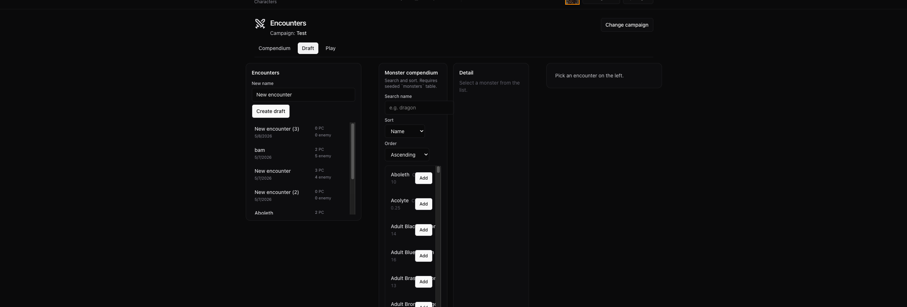

## Compendium
  - in draft mode: add button top right of detail window
  - image: bigger, show more, normalize ratio so all look good
  - image: when cropping vertically. show top part, not center
  - image clickable -> show full in overlay
  

## Draft
  - encounter list
    - extract as own component
  - encounter info panel
    - extract as own component
  - encounter list row
    - remove buttons
    - move to encounter info panel
  - 2 column layout on desktop
     - left: encounter list
     - right: encounter info
  - change
    - mobile: keep previous layout (list, info, compendium; vertical)
    - desktop
      - monster compendium in the middle
      - side bar left: encounter list
      - side bar right: encounter info
      - 
        - sidebars floating left and right where empty space is
      - sidebar positioning is good, but take more vertical space
      - center content (monsters): take up entire with of main content area

      - remove standalone compendium tab from draft
      - compendium add buttons: add plus icon and change button to be darker

## run encounter row
- Avatar Frame
  - inspiration: hearthstone hero cards
  - Bottom: Flat
  - Top: half circle
  - position: lining up with left side of row, circular top part extending upward past the row itself 

  - default pc avatars should have consistent background color. is not filled out entirely yet
  - frames bigger. borders bigger. gold border for pc, silver border for enemy
  - stat block in encouter row more compact
    - 2 rows, aligned right, text left

## Player avatar
  - allow upload of image
  - add image to character
  - display avatar of selected character on top menu

  - create avatar component
    - on character create, select class specific default
    - upload dialog = click avatar -> hover caption "change"
    - show uploaded image
    - use this in character edit instead of file upload button
    - show in character list
    - use in encounter row
  
  - character list
    - layout:  portrait left, text right
  - character edit: read only mode
    - show avatar in title 
      - left avatar
      - right everything else
  - when changing used character update top user icon in real time

## menu
  - new menu layout
  - Play -> PlayFeature
  - Compendium -> Tabs for different objects -> only monsters currently
  - DM 
    - Campaigns
    - Encounter
  - User Icon (interactible)
    - Manage Characters

## player card
  - short number input  with icon buttons 
    - (drop) damage (-> opens damage form)
    - cross (bold plus symbol) -> heal

# General

## Number inputs
  - centralized input element
  - auto format to 2 digit number < 40 on roll/skill check related inputs
    - ex. initiative, ability score
  - no leading zeroes
  - format on blur. no interfere while typing

  ## Colors
  - highlight and button colors: with less contrast -> white is too much
  - apply everywhere
  - define globally for easy edits

  ## new account testing
    - characters list loading error
    - supabase urls: status 500
      - response "{
        "code": "54001",
        "details": null,
        "hint": "Increase the configuration parameter \"max_stack_depth\" (currently 2048kB), after ensuring the platform's stack depth limit is adequate.",
        "message": "stack depth limit exceeded"
    }"
    - create campaign: response:
      - {
    "code": "42501",
    "details": null,
    "hint": null,
    "message": "new row violates row-level security policy for table \"campaigns\""
}

## problem
  - create campaign with new user
  payload: {"name":"2","description":"asd"}
  status: 403
  result: {
    "code": "42501",
    "details": null,
    "hint": null,
    "message": "new row violates row-level security policy for table \"campaigns\""
}

## character play mode 
	- spells tab
	- show spell slots before cantrips
	- fix spell card descriptions

	- when selecting to upcast a spell, show part of spell description in popup after but including the words "At higher levels"

	- PlayHeader
		- Show Portrait in desktop mode
		- leave space for sublass (behind classname)
		- show hp and ac in separate column
		- show Spell stats: (atk, save) in separate column
		- add button for adding conditions under the rest button
			- get conditions from srd
			- import into supabase
		- display conditions at bottom of playerHeader as pills
			- add small "x" to delete
			- long rest clears all conditions

	- RestDialog
		- Format Lonng Rest like the short rest box (short description, button "Take Long Rest" in same style as "Apply" button)

	- i renamed srd_conditions to just conditions (updated sb table name and all occurences)
	- conditions should not have the x, instead clicking them will show popup with description
		- popup has option to remove condition

	- each condition should have a color that matches it
		- pills should be displayed in that color
		- make sure the color is distinct and works in light and dark mode
	- no title for conditions, they are self explanatory

	- for any text that has sections wrapped in "**", make text bold
		- makea global function and apply to all description texts across the database

	- on large and medium size screens, in play > general tab, make stat blocks into double rows i.e. str/dex first line, con int second line etc

	- in encounter turn order, show conditions on player characters
		- for npcs, add the option to add conditions
		- use same visuals as in character play mode
		 	- extrapolate a ui element into components/ui for the condition pills
	
	- encounter turn order
		- reformat row
			- top right: initiative input
			- below: input row dmg/healing
				- below dmg / heal buttons
			- left: avatar
			- next column: name + hp
			- next column: conditions
		- fix conditions
			- button is there, reloads page
				- avoid page reload/rerender
				- make status pills appear
	
	- initiative input shorter (space for 2-3 digits)
	- initiative label inline with input, smaller
	- dmg/heal input shorter (2-3 digits)
		- no label damage/heal
		inline input, dmg, heal, no breaks